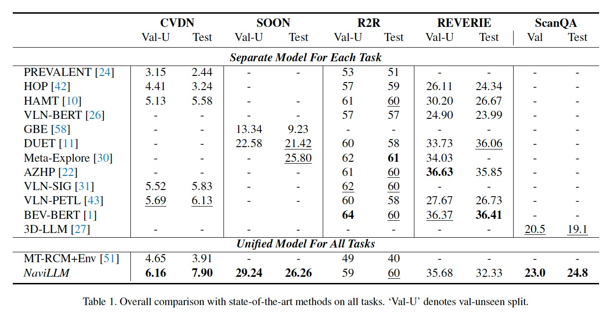

# Towards Learning a Generalist Model for Embodied Navigation

## Abstract
Abstract Building a generalist agent that can interact with the world is an ultimate goal for humans, thus spurring the research for embodied navigation, where an agent is required to navigate according to instructions or respond to queries. Despite the major progress attained, previous works primarily focus on task-specific agents and lack generalizability to unseen scenarios. Recently, LLMs have presented remarkable capabilities across various fields, and provided a promising opportunity for embodied navigation. Drawing on this, we propose the first generalist model for embodied navigation, *NaviLLM*. It adapts LLMs to embodied navigation by introducing schema-based instruction. The schema-based instruction flexibly casts various tasks into generation problems, thereby unifying a wide range of tasks. This approach allows us to integrate diverse data sources from various datasets into the training, equipping *NaviLLM* with a wide range of capabilities required by embodied navigation. We conduct extensive experiments to evaluate the performance and generalizability of our model. The experimental results demonstrate that our unified model achieves state-of-the-art performance on CVDN, SOON, and ScanQA. Specifically, it surpasses the previous stats-of-the-art method by a significant margin of **29%** in goal progress on CVDN. Moreover, our model also demonstrates strong generalizability and presents impressive results on unseen tasks, e.g., embodied question answering and 3D captioning.

## Overview of *NaviLLM*

<p align="center">
    <br>
</p>

## Experiments
<p align="center">
    <br>
</p>

With only a single model, NaviLLM has achieved new state-ofthe-
art results simultaneously on multiple benchmarks, i.e.
CVDN, SOON, and ScanQA, and demonstrated
comparable performance to latest models on R2R and
REVERIE.
Additionally, it also won the first place on [CVDN leaderboard](https://eval.ai/web/challenges/challenge-page/463/leaderboard/1292) and the second place on [ScanQA leaderboard](https://eval.ai/web/challenges/challenge-page/1715/leaderboard/4107).

## Installation
1. Install the [MatterPort 3D simulator](https://github.com/peteanderson80/Matterport3DSimulator). Please add the simulator path to yout python path.
```
export PYTHONPATH=Matterport3DSimulator/build:$PYTHONPATH
```

2. Set up the Java Development Kit (JDK), if you want to enable METEOR while evaluating ScanQA. Otherwise, please comment out the related code. 
```
export JAVA_HOME=$jdk_path
export PATH=$JAVA_HOME/bin:$PATH
export CLASSPATH=.:$JAVA_HOME/lib/dt.jar:$JAVA_HOME/lib/tools.jar
```

3. Create the conda environment and install the requirements.
```
conda create --name navillm python=3.8.16
conda activate navillm
pip install -r requirements.txt
```

## Data Processing and Models
The data directory is structed as follows. And we will release the processed data and checkpoints as soon as possible.


```
data
├── connectivity
├── CVDN
├── LLaVA
├── SOON
├── R2R
├── REVERIE
├── EQA
├── eva_features
│   ├── mp3d_EVA02-CLIP-L-14-336.hdf5
│   ├── scanqa_EVA02-CLIP-L-14-336.hdf5
│   └── coco_EVA02-CLIP-L-14-336.hdf5
├── obj_features
│   ├── reverie_obj_feat
│   └── soon_obj_feat
├── models
    └── Vicuna-7B
```

**1. Orinal Datasets**
* R2R & REVERIE & SOON: we use the annotation provided by [DUET](https://github.com/cshizhe/VLN-DUET).
* CVDN: The annotation could be downloaded from [the official repository](https://github.com/mmurray/cvdn).
* ScanQA: Please download the annotation and frames extracted from ScanNet at [here](https://github.com/ATR-DBI/ScanQA/blob/main/docs/dataset.md).
* LLaVA: [LLaVA-detail-23k](https://huggingface.co/datasets/liuhaotian/LLaVA-Instruct-150K) is used for insturction following.
* Augmented Data from R2R and REVERIE: We utilize the augmented data generated by [DUET](https://github.com/cshizhe/VLN-DUET).


**2. Image Features**

The image features are extracted with [EVA-CLIP-02-Large (428M)](https://github.com/baaivision/EVA). And we also provide scripts used for extracting features from MP3D, ScanQA, COCO at [scripts/data_tools](scripts/data_tools). To use EVA-CLIP-02, please install the corresponding environment following the instruction of th original reposity.
```
cd scripts/data_tools
sh extract_features_mp3d.sh         # for Matterport3D
#   sh extract_features_scanqa.sh   # for ScanQA
#   sh extract_features_coco.sh     # for COCO
```

**3. Object Features**

We leverage the object features extracted from ViT-B16 by [HM3DAutoVLN](https://github.com/cshizhe/HM3DAutoVLN),  and put the processed features of REVERIE and SOON at data/obj_features. You could either disable the object features by removing the flag `--enable_og`.


**4. Models**

The LLM is built upon [Vicuna-7B-v0](https://huggingface.co/lmsys/vicuna-7b-delta-v0/tree/main). Please download the pre-trained model and put it at data/models.


## Training & Inference
**1. Pretraining**:
The model is trained for 10,000 steps in the pretraining
stage with a batch size of 64. In the pre-training stage, we perform teacher forcing training on the combined dataset from CVDN, SOON, R2R, REVERIE, ScanQA, and augmented data from R2R and REVERIE.
```
sh scripts/pretrain.sh
```

**2. Multi-task Tuning with Pretraining**: 
The model is trained for 5,000 steps in the multi-task fine-tuning
stage with a batch size of 64. In the multi-task fine-tuning stage, we alternate between teacher forcing and student forcing on the combined dataset from CVDN, SOON, R2R, REVERIE, ScanQA, and LLaVA-23k.
```
sh scripts/multi_w_pretrain.sh
```

**3. Multi-task Tuning without Pretraining**:

Since the performance of direct multi-task finetuning is comparable to the two-stage training, we recommend multi-task finetuning without pretraining here. It takes approximately 20 hours with 8 Nvidia A100 GPUs.
```
sh scripts/multi_wo_pretrain.sh
```

**4. Inference**:
During the testing phase, we employ a sampling strategy with a temperature of 0.01 for action generation in the SOON and REVERIE tasks, to encourage more exploration. For other tasks, we opt for a greedy strategy in generating actions.
```bash
sh scripts/evaluation/eval_cvdn.sh  # eval_soon.sh/eval_r2r.sh/eval_reverie.sh/eval_scanqa.sh
```

## Acknowledgements
We would like to thank MatterPort 3D for their contributions to the open-sourced platform and community.
Additionally, this work benefits from [DUET](https://github.com/cshizhe/VLN-DUET), [HM3DAutoVLN](https://github.com/cshizhe/HM3DAutoVLN), and [VLN-SIG](https://github.com/jialuli-luka/VLN-SIG). Thanks for their awesome works!